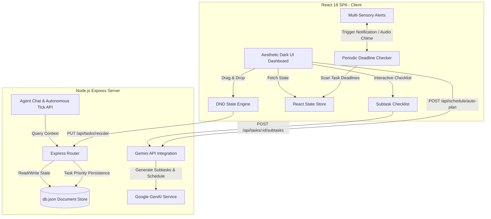
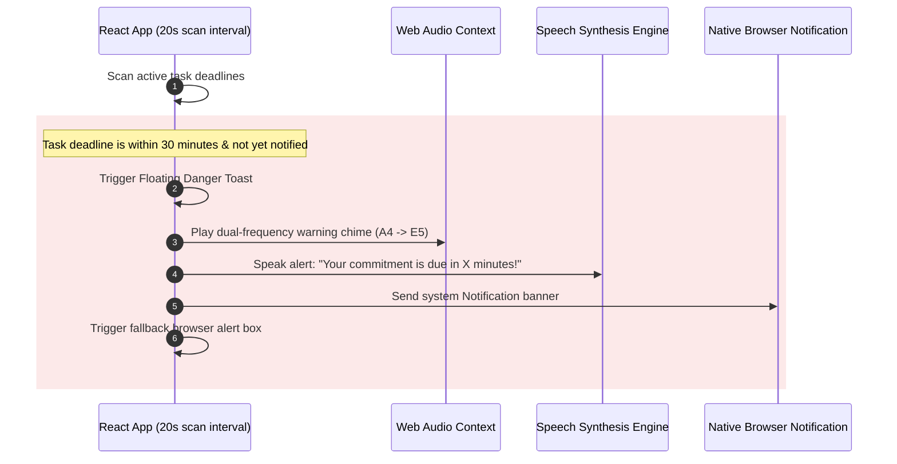
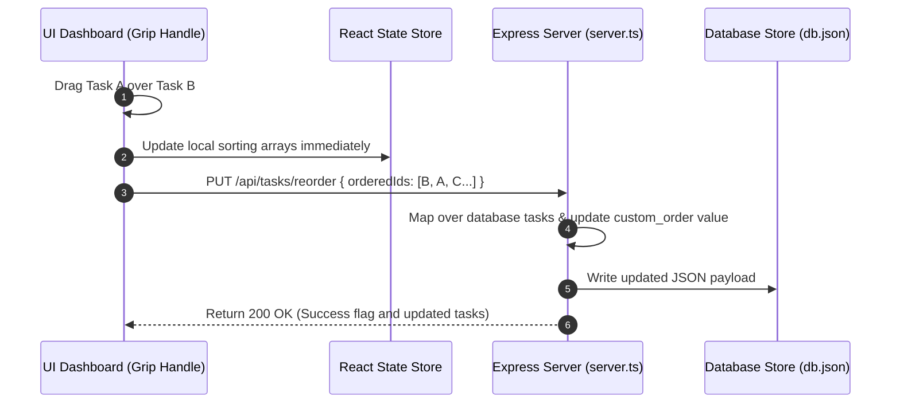
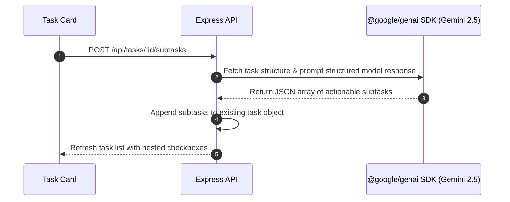

# DeadlineGuardian: Agentic Time Planner & Smart Task Scheduler

A full-stack, AI-driven time management ecosystem featuring reactive drag-and-drop scheduling, autonomous planning agents, and a proactive multi-sensory notification pipeline.

---

## 1. Problem Statement
Modern professionals and students face unprecedented cognitive load due to fragmented tasks, shifting priorities, and hidden deadlines. Existing digital planners are passive, relying entirely on manual updates and failing to adapt dynamically when tasks become urgent.
- **Passive Alarm Fatigue:** Traditional static calendars send standard push notifications that are easily dismissed or missed entirely, leading to overcommitment and missed targets.
- **Plan Paralysis:** Breaking down abstract goals into actionable subtasks requires cognitive effort, leading to procrastination.
- **Rigid Scheduling:** Manual reordering is tedious, and rigid priority algorithms fail to reflect human intuitive task sequencing.

---

## 2. Solution Overview
**DeadlineGuardian** transforms task management into an active, intelligent partner. Combining a fluid React SPA frontend with a robust Node.js Express backend, DeadlineGuardian implements server-side AI processing to continuously monitor, adapt, and protect your schedule.
1. **Intelligent Guardian Agent:** A proactive background routine that evaluates deadlines and warns the user precisely 30 minutes before a target with visual toasts, system alerts, audio chimes, and text-to-speech synthesis.
2. **Generative Task Deconstruction:** Leverages the Gemini API to break high-level assignments into bite-sized, interactive checklists.
3. **Intuitive Priority Control:** Users can drag-and-drop tasks to establish a custom priority queue, which is instantly persisted in a full-stack database model.

---

## 3. Core Architecture & Workflows

### Architecture Diagram

---

## 4. Key Workflows & Diagrams

### A. Intelligent 30-Minute Notification Workflow
Monitors deadline compliance using low-latency client-side interval scans. When a deadline enters the 30-minute critical threat window, the guardian triggers a cascading multi-sensory alarm sequence.

### B. Drag & Drop Task Reordering Workflow
Maintains a custom schedule layout using a persisted `custom_order` parameter, allowing users to override priority score rankings seamlessly.

### C. AI Subtask Breakdown Workflow
Converts complex tasks into modular execution points automatically.

---

## 5. Key Features
- **Aesthetic Cosmic Dark Theme:** Immersive twilight visual layout engineered with generous negative space, high contrast typography, and responsive micro-animations powered by `motion` and Tailwind.
- **Proactive Notification System:** Uses client-side scanning to trigger dual-tone audio warnings, native desktop push notices, dynamic text-to-speech voice notifications, and emergency modal alerts.
- **Fluid Drag & Drop Layout:** Custom reordering lists supported with native drag event handlers, tactile styling states (`active:cursor-grabbing`, scale animations), and a persisted database custom-order engine.
- **AI-Driven Decomposition:** Dynamic subtask generator powered by Google GenAI which populates an interactive nested checkbox list.
- **Autonomous Tick Mode:** An agent-oriented simulated loop that analyzes productivity trends, evaluates overcommitment metrics, and suggests schedules using predictive intelligence.

---

## 6. Technologies Used

### Frontend & UI Stack
- **React 18 & Vite:** High-performance, low-latency framework and bundler.
- **Tailwind CSS:** Comprehensive utility styling maximizing interface design with responsive grid layouts.
- **Framer Motion:** High-fidelity, smooth state transitions and exit animations for drag-and-drop feedback and notifications.
- **Lucide React:** Sleek, consistent minimalist vector iconography.

### Backend Stack
- **Node.js & Express:** Lightweight, high-throughput server.
- **TypeScript:** Fully typed end-to-end schemas for models (`types.ts`), server configurations, and payload validations.
- **esbuild:** Bundles TS compilation cleanly into a consolidated `dist/server.cjs` file for production deployment.

---

## 7. Google Technologies Used

- **Gemini API (`@google/genai` SDK):** Powers core agentic components including automated time planning, pattern analysis, autonomous decision ticks, and structural task breakdowns.
- **Google Cloud Run:** Hosts the containerized runtime, routing ingress traffic safely and handling server-side environment secrets.
